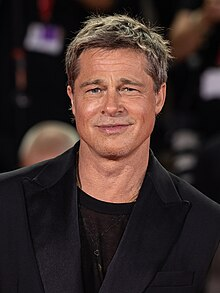

# William Bradley Pitt

[William Bradley Pitt](https://en.wikipedia.org/wiki/Brad_Pitt#) (born December 18, 1963) is an American actor and film producer. He is the recipient of various accolades, including two Academy Awards, two British Academy Film Awards, two Golden Globe Awards, and a Primetime Emmy Award. One of the most influential celebrities, Pitt appeared on Forbes' annual Celebrity 100 list from 2006 to 2008, and the Time 100 list in 2007.

Pitt first gained recognition as a cowboy hitchhiker in the Ridley Scott road film Thelma & Louise (1991). Pitt emerged as a star taking on leading man roles in films such as the drama A River Runs Through It (1992), the western Legends of the Fall (1994), the horror film Interview with the Vampire (1994), and the crime thriller Seven (1995).

- Born 18 December 1963
- Graduated Kickapoo Highschool
- Attended University of Missouri
- Dropped university and moved to Los Angeles
- Began his acting career with uncredited parts in the films No Way Out (1987), No Man's Land (1987) and Less than Zero (1987).
- Portrayed Tyler Durden in [Fight Club(1999)](https://en.wikipedia.org/wiki/Fight_Club) that became a cult classic following its release on DVD
- Starred in Troy(2004), which earned him worldwide recognition